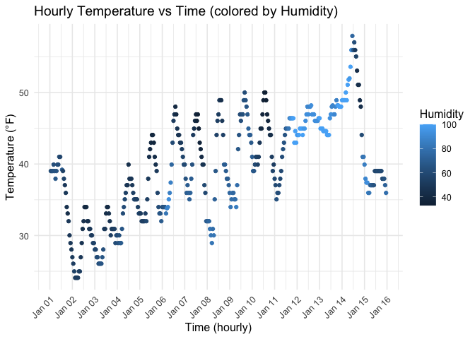

Homework 1 - P8105 Data Science I
================
Yongyan Liu (yl6107)
2025-09-13

- [Problem 1](#problem-1)
- [Problem 2](#problem-2)

## Problem 1

``` r
library(moderndive)

data("early_january_weather")
```

The `early_january_weather` dataset is the hourly meteorological data
for LGA, JFK and EWR for the first half month of January 2013. This is a
subset of the weather data frame from nycflights13.

The variables in this data set includes:

- **origin**: Weather station. Named origin to facilitate merging with
  nycflights13::flights data.
- **year**, **month**, **day**, **hour**: Time of recording.
- **temp**, **dewp**: Temperature and dewpoint in Fahrenheit.
- **humid**: relative humidity.
- **wind_dir**, **wind_speed**, **wind_gust**: Wind direction (in
  degrees), speed and gust speed (in mph).
- **precip**: Precipitation, in inches.
- **pressure**: Sea level pressure in millibars.
- **visib**: Visibility in miles.
- **time_hour**: hourly timestamps (POSIXct).

This data set has 358 rows and 15 columns. The mean temperature during
this period is 39.5821229 °F.

``` r
library(tidyverse)
```

    ## ── Attaching core tidyverse packages ──────────────────────── tidyverse 2.0.0 ──
    ## ✔ dplyr     1.1.4     ✔ readr     2.1.5
    ## ✔ forcats   1.0.0     ✔ stringr   1.5.1
    ## ✔ ggplot2   3.5.2     ✔ tibble    3.3.0
    ## ✔ lubridate 1.9.4     ✔ tidyr     1.3.1
    ## ✔ purrr     1.1.0     
    ## ── Conflicts ────────────────────────────────────────── tidyverse_conflicts() ──
    ## ✖ dplyr::filter() masks stats::filter()
    ## ✖ dplyr::lag()    masks stats::lag()
    ## ℹ Use the conflicted package (<http://conflicted.r-lib.org/>) to force all conflicts to become errors

``` r
temp_plot <- ggplot(
  early_january_weather, 
  aes(x = time_hour, y = temp, color = humid)
  ) +
  geom_point() +
  scale_x_datetime(
    date_breaks = "1 day",
    date_labels = "%b %d"
  ) +
  labs(
    title = "Hourly Temperature vs Time (colored by Humidity)",
    x = "Time (hourly)",
    y = "Temperature (°F)",
    color = "Humidity"
  ) +
  theme_minimal(base_size = 12) +
  theme(axis.text.x = element_text(angle = 45, hjust = 1))

temp_plot # show the plot
```

<!-- -->

From the visualization, we can make the following observations:

- Temperature goes up in the afternoon and down at night, showing a
  pattern of daily cycles.
- Higher humidity (darker color) often happens when the temperature is
  low. When humidity is higher, the difference between day and night
  temperature is smaller.
- In January 15, the day and night temperatures are almost the same, but
  the humidity is not so high, maybe because of a data error.

``` r
ggsave("temp_trend.png", plot = temp_plot, width = 7, height = 5, dpi = 300)
```

## Problem 2

Create a data frame comprised of:

- a random sample of size 10 from a standard Normal distribution
- a logical vector indicating whether elements of the sample are greater
  than 0
- a character vector of length 10
- a factor vector of length 10, with 3 different factor “levels”

``` r
x           <- rnorm(10)            # numeric
x_gt_0      <- x > 0                # logical
char_vec    <- sample(letters, 10)  # character vector

# define 3 levels and generate the factor vector
level_vec   <- c("low","med","high")
factor_vec  <- factor(
                  sample(level_vec, 10, replace=TRUE), 
                  levels = level_vec)

df <- tibble(x, x_gt_0, char_vec, factor_vec)
str(df)   # show the data frame
```

    ## tibble [10 × 4] (S3: tbl_df/tbl/data.frame)
    ##  $ x         : num [1:10] -1.329 -0.102 1.167 1.159 2.331 ...
    ##  $ x_gt_0    : logi [1:10] FALSE FALSE TRUE TRUE TRUE FALSE ...
    ##  $ char_vec  : chr [1:10] "o" "r" "l" "f" ...
    ##  $ factor_vec: Factor w/ 3 levels "low","med","high": 3 1 3 1 1 3 1 2 1 2

Try to take the mean of each variable in your dataframe.

``` r
mean(pull(df, x))           # works
```

    ## [1] 0.4978505

``` r
mean(pull(df, x_gt_0))      # works
```

    ## [1] 0.6

``` r
mean(pull(df, char_vec))    # doesn't work
```

    ## Warning in mean.default(pull(df, char_vec)): argument is not numeric or
    ## logical: returning NA

    ## [1] NA

``` r
mean(pull(df, factor_vec))  # doesn't work
```

    ## Warning in mean.default(pull(df, factor_vec)): argument is not numeric or
    ## logical: returning NA

    ## [1] NA

Write a code chunk that applies the as.numeric function to the logical,
character, and factor variables (please show this chunk but not the
output).

``` r
num_from_logical    <- as.numeric(df$x_gt_0)
num_from_character  <- as.numeric(df$char_vec)
num_from_factor     <- as.numeric(df$factor_vec)
```

What happens, and why? Does this help explain what happens when you try
to take the mean?

When we change the variable types to numbers, the results make sense.
Logical values turn into 0 and 1, so taking the mean gives the
proportion of TRUE values. Character values cannot really become
numbers, so they turn into missing values. Factor values turn into their
hidden codes, like 1, 2, 3, but the mean of these codes does not show
any real meaning.

This explains why some variables work with mean and some do not. Numbers
and logical values can be averaged, but characters and factors cannot be
used directly unless we change them first, and even then the result may
not be useful.
